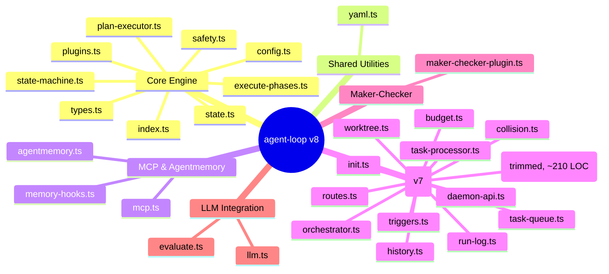

# agent-loop — v8 Architecture

Bun/TS loop orchestrator: 4-state machine, plugin phases, MCP execution, agentmemory hooks, HTTP/WS daemon, plan-driven execution, LLM integration (OpenAI + Anthropic), triggers, multi-loop orchestrator, git worktree isolation. Runtime deps: js-yaml v5. ~2600 LOC (30 src files), 438 tests (33 test files).

## Architecture



## Modules by Subsystem

### Core Engine (9 files)
| File | Role |
|------|------|
| index.ts | Barrel export (12 lines) |
| types.ts | Core types: StateMachineState, PhaseDef, LoopConfig, PhaseResult, LoopState, LoopResult, Judgment |
| state-machine.ts | 4-state (init/run/verify/done) × 6-event flat lookup, ~49 LOC |
| state.ts | Dual persistence: STATE.md (YAML frontmatter via yaml.ts) + state.json, ~134 LOC |
| safety.ts | executeWithTimeout (AbortController), max iterations cap (20), SIGINT handler, ~73 LOC |
| config.ts | DEFAULT_CONFIG, parseLoopArgs, mergeConfig (hard cap 20), ~81 LOC |
| plugins.ts | Plugin interface, HookContext, loadPlugins (dynamic import), executeHooks at 5 lifecycle points, ~116 LOC |
| plan-executor.ts | YAML-based plan loader (via yaml.ts), parsePlanYaml / dumpPlanYaml, plan-driven loop plugin (beforeLoop / afterLoop), ~95 LOC |
| execute-phases.ts | Shared phase execution: executePhaseGroup() extracted from loop.ts runLoop/tick duplication, ~143 LOC |

### Shared Utilities (1 file)
| File | Role |
|------|------|
| yaml.ts | js-yaml wrapper: loadYaml, parseYaml (safe), dumpYaml, parseFrontmatter (--- delimited), dumpFrontmatter, ~40 LOC |

### MCP Execution (1 file)
| File | Role |
|------|------|
| mcp.ts | MCP subprocess execution via JSON-RPC 2.0 over stdin/stdout, ~167 LOC |

### Legacy API Server (v5, superseded by daemon.ts)
| File | Role |
|------|------|
| api.ts | Original Bun.serve HTTP/WS server: GET /state, POST /start/stop/trigger, WebSocket broadcasts, ~103 LOC |

### Agentmemory (2 files)
| File | Role |
|------|------|
| agentmemory.ts | HTTP client to localhost:3111 (fetch), 5 endpoints: save, recall, archive, lesson, pulse, ~183 LOC |
| memory-hooks.ts | Lifecycle callbacks: onLoopComplete, onPhaseFailed, logPhaseContext, ~194 LOC |

### Evaluation (1 file)
| File | Role |
|------|------|
| evaluate.ts | LLM-based semantic evaluation or exit-code fallback, Judgment type with passed/reason/confidence, ~96 LOC |

### Daemon Infrastructure — v7 (13 files)
| File | Role |
|------|------|
| daemon.ts | HTTP/WS server orchestration only (~210 LOC). Handles Bun.serve lifecycle, delegates task execution to task-processor.ts and route handling to routes.ts |
| daemon-api.ts | Seam interface (DaemonAPI) — narrow contract between routes and Daemon class |
| routes.ts | All HTTP/WS route handlers as standalone functions via createFetchHandler(DaemonAPI) |
| task-processor.ts | Task execution logic: executeTask, processQueue, isSafeCommand. Extract from daemon.ts |
| task-queue.ts | FIFO queue with enqueue/dequeue/complete/fail/cancel, JSON serialization, ~132 LOC |
| triggers.ts | CronTrigger (full parser: */step, N-M, N,M, *), FileWatchTrigger (debounced, pattern filter, auto-move), TriggerManager, ~316 LOC |
| orchestrator.ts | LoopOrchestrator — manages child loops with lifecycle, trigger registration, YAML config loader (via yaml.ts), ~216 LOC |
| worktree.ts | Git worktree management: create/run/discard/verify for isolated changes |
| collision.ts | Priority-based collision detection between loop patterns via STATE.md frontmatter |
| history.ts | Task and loop run history persistence |
| budget.ts | Daily run budget counter with report-only mode at 80% cap |
| init.ts | One-shot project initialization checks |
| run-log.ts | Run log file management |

### Maker-Checker Plugin (1 file)
| File | Role |
|------|------|
| maker-checker-plugin.ts | Dual-phase execution (maker+checker) with LLM-based verification and retry logic, ~152 LOC |

### LLM Integration — v7 (1 file)
| File | Role |
|------|------|
| llm.ts | Raw-fetch HTTP clients for OpenAI + Anthropic (no SDKs), custom endpoints (Ollama), dotted-path response extraction, ~180 LOC |

## Data Flow

1. CLI → config.ts parses args (including `--plan <path>`), merges with DEFAULT_CONFIG
2. plan-executor.ts `beforeLoop` reads `.plan.yaml` → maps tasks to PhaseDef[]
3. index.ts → state-machine.ts drives loop: execute phases → collect results → evaluate → persist → repeat or exit
4. Each phase runs via mcp.ts (MCP subprocess) or executePhaseGroup() (shared runLoop/tick path)
5. plan-executor.ts `afterLoop` writes status/duration/completedAt back to `.plan.yaml`
6. state.ts persists after every transition (~6 writes per iteration)
7. plugins.ts hooks into lifecycle — loadPlugins + executeHooks at 5 points
8. memory-hooks.ts fires on completion/failure — fire-and-forget HTTP to agentmemory
9. daemon.ts serves REST API + WebSocket via routes.ts when daemon mode is active
10. triggers.ts fires scheduled/file-watch events → orchestrator.ts spawns child loop instances
11. worktree.ts isolates code changes in git worktrees for L2 fix attempts
12. collision.ts prevents conflicting loop patterns from running simultaneously
13. llm.ts provides OpenAI/Anthropic/Ollama backends — used by evaluate.ts and maker-checker-plugin.ts

## State Machine

```
  init ──RUN──> run ──VERIFY──> verify ──COMPLETE──> done
                   ^                  |
                   └──── LOOP ────────┘
```

| State | Events → Next |
|-------|-------------|
| init | RUN → run, ABORT → done |
| run | VERIFY → verify, ABORT → done |
| verify | COMPLETE → done, LOOP → init, FAILED → done, ABORT → done |
| done | (terminal) |

## Key Decisions

- **ADR-0001**: Raw HTTP (fetch to localhost:3111) over MCP subprocess for agentmemory — lower latency, smaller failure surface (`docs/adr/0001-raw-http-agentmemory-transport.md`)
- **ADR-0003**: Use js-yaml instead of custom YAML parsers. All YAML processing consolidated into `src/yaml.ts`. Reduces hand-rolled parser code by ~270 LOC
- **ADR-0004**: DaemonAPI seam interface — routes never touch Daemon internals directly
- **ADR-0005**: Shared executePhaseGroup() — eliminates ~50 LOC of duplication between runLoop() and tick()
- **Fire-and-forget memory ops**: All agentmemory calls are fire-and-forget with 2s timeout, no retry, errors swallowed
- **Ponytail patterns**: Flat lookup state machine (no OOP), AbortController for timeouts, mutable global for SIGINT

## Plan-Driven Execution

The `--plan <path>` CLI flag enables plan-driven mode. When set, the loop loads a `.plan.yaml` file before the first iteration and writes results back after completion.

### Flow

1. `--plan path/to/plan.yaml` parsed by config.ts → `LoopConfig.planPath`
2. `beforeLoop` hook (plan-executor.ts) reads `.plan.yaml` via yaml.ts, maps tasks to `PhaseDef[]`, and populates the loop's phase queue
3. Loop executes phases normally (state-machine driven)
4. `afterLoop` hook (plan-executor.ts) writes `status`/`duration`/`completedAt` back to `.plan.yaml`
5. Updated plan file serves as a persistent record of execution results

### Implementation

- `plan-executor.ts` contains `parsePlanYaml()` (reads `.plan.yaml` → `PhaseDef[]`) and `dumpPlanYaml()` (writes `LoopResult` back to YAML)
- Uses `yaml.ts` (js-yaml wrapper) for all YAML parsing and serialization
- Plugin export: `createPlugin()` returns `{ name: "plan-executor", beforeLoop, afterLoop }` — registered via `plugins` config or auto-loaded when `--plan` is set
- New types in `types.ts`: `PhaseResult` gains `duration` and `completedAt` fields; `LoopConfig` gains optional `planPath`

## Configuration

| Key | Default | Description |
|-----|---------|-------------|
| maxIterations | 3 (cap 20) | Loop iterations |
| task | "demo" | Task preset name |
| phases | all | Comma-separated phase filter |
| timeout | 30000 | Per-phase timeout ms |
| memory.enabled | false | Enable agentmemory hooks |
| port | 3000 | Daemon/API server port |
| plugins | [] | Plugin file paths |
| planPath | undefined | Path to `.plan.yaml` for plan-driven execution |
| daemon | false | Run in daemon mode (REST API + WS) |
| triggers | [] | Trigger configs (cron/file-watch) for daemon |
| llm.provider | undefined | LLM provider: "openai" \| "anthropic" \| custom endpoint |

## v7 Features — Daemon Infrastructure (refactored)

- **Daemon** — Trimmed from 572→~210 LOC. Now orchestrates Bun.serve lifecycle only. Routes extracted to routes.ts, task execution to task-processor.ts
- **DaemonAPI seam** — Narrow interface (getState, stop, isAuthorized, isPaused, broadcast, maybeProcessQueue + readonly properties) prevents routes from accessing Daemon internals
- **Routes** — All HTTP/WS handlers extracted to standalone functions in routes.ts, receiving only DaemonAPI
- **Task processor** — executeTask, processQueue, isSafeCommand extracted to task-processor.ts with full test coverage
- **Task queue** — In-memory FIFO queue with enqueue/dequeue/complete/fail/cancel, timeout support, persistent history
- **Triggers** — CronTrigger (full cron expression parser: */step, N-M, N,M, *) and FileWatchTrigger (debounced, pattern-filtered, auto-move processed files). TriggerManager registers and supervises all triggers
- **Multi-loop orchestrator** — LoopOrchestrator manages child loop instances with lifecycle (start/stop), YAML config loading (via yaml.ts), per-loop trigger registration
- **Git worktree isolation** — Worktree.ts creates disposable git worktrees for every L2 fix attempt, verifies before committing, discards on failure
- **Collision detection** — Priority-based collision detection between loop patterns by reading STATE.md frontmatter. Prevents conflicting loops from running simultaneously
- **Maker/checker plugin** — Dual-phase execution (maker proposes, checker verifies) with LLM-based verification, confidence scoring, and retry logic
- **Budget guard** — Daily run counter (default 100). At 80% → report-only mode. At 100% → stop accepting new tasks
- **Dashboard SPA** — Single-page application served by the daemon for real-time monitoring
- **Plans/patterns** — YAML-based plan files with task definitions, LLM prompts, status tracking. Pre-built: `daily-triage.yaml`, `pr-babysitter.yaml`

## v8 Improvements

- **Daemon slice** (ADR-0004): Extracted routes, task-processor, and DaemonAPI from daemon.ts. Reduced daemon.ts from 571→~210 LOC (63% reduction). Routes testable in isolation via DaemonAPI mock
- **YAML consolidation** (ADR-0003): Replaced 4 custom YAML parsers (~390 LOC) with js-yaml v5 via shared yaml.ts (~40 LOC). Reduced state.ts by ~15%, plan-executor.ts by ~5%, orchestrator.ts by ~40%. Only runtime dependency added
- **Loop dedup** (ADR-0005): Extracted executePhaseGroup() from runLoop()/tick() duplication (~50 LOC from each). Created execute-phases.ts with ExecutionDeps interface. Phase execution now testable in isolation
- **Test coverage**: 438 tests (up from 393 baseline), 33 test files, 984 expect() calls

## Plugin System

5 hook points: `onPhaseStart` / `onPhaseEnd` / `onError` / `beforeLoop` / `afterLoop`. Plugins are dynamically imported modules exporting `createPlugin(): Plugin`. Used by memory-hooks and plan-executor internally; extensible for user plugins.

## Test Strategy

438 tests across 33 test files. Run: `bun test __tests__/`

| Area | Files |
|------|-------|
| State machine | state-machine.test.ts |
| Persistence | state.test.ts |
| Safety | safety.test.ts |
| Config | config.test.ts |
| MCP execution | mcp.test.ts |
| Plugins | plugins.test.ts |
| Plan types | plan-types.test.ts |
| Plan executor | plan-executor.test.ts |
| Execute phases | execute-phases.test.ts |
| Loop + plan integration | loop-plan.test.ts |
| Loop integration | loop-integration.test.ts |
| Agentmemory | agentmemory.test.ts |
| Memory hooks | memory-hooks.test.ts |
| API server (v5) | api.test.ts |
| Evaluation | evaluate.test.ts |
| Task queue | task-queue.test.ts |
| Task processor | task-processor.test.ts |
| Routes | routes.test.ts |
| Daemon | daemon.test.ts |
| Daemon v6 | daemon-v6.test.ts |
| Daemon pause | daemon-pause.test.ts |
| Triggers | triggers.test.ts |
| Orchestrator | orchestrator.test.ts |
| Collision | collision.test.ts |
| Worktree | worktree.test.ts |
| History | history.test.ts |
| Budget | budget.test.ts |
| Init | init.test.ts |
| Run log | run-log.test.ts |
| Maker-checker | maker-checker.test.ts |
| LLM (OpenAI) | llm.test.ts |
| LLM API | llm-api.test.ts |
| YAML utils | yaml.test.ts |

## Quick Start

```bash
bun run loop.ts start --task demo                           # run demo
bun run loop.ts start --task demo --max-iterations 3         # 3 iterations
bun run loop.ts start --task demo --phases scan,report       # filter phases
bun run loop.ts start --plan path/to/plan.yaml               # plan-driven execution
bun run loop.ts daemon --port 3000                           # start daemon (REST API + WS)
bun run loop.ts daemon --plan plans/daily-triage.yaml        # daemon + scheduled plan
bun test __tests__/                                          # run all tests (438)
bun test __tests__/task-processor.test.ts                    # run task-processor tests only
bun run loop.ts start --help                                 # all options
```

State output: `_agent-loop-output/STATE.md` + `_agent-loop-output/state.json`.

## Glossary

- **Budget guard**: A run counter, not a token/dollar cap. Configurable daily run limit (default 100 runs/day). At 80% → force report-only mode. At 100% → stop accepting new tasks. Measured in runs, not tokens or dollars.
- **Kill switch**: A pause mechanism, not a hard stop. Sets a `paused: true` flag in STATE.md. Daemon stays alive and can be resumed via API. Does not kill the daemon process.
- **Daily triage**: A pattern that reads STATE.md (no external sources like GitHub/CI) and produces a prioritized LLM report. Sources are internal only — the loop's own state file, recent run log, and LLM analysis. No GitHub issues, no CI status.
- **Pattern**: A plan.yaml file that runs on a schedule with a specific purpose (daily triage, PR babysitter, etc.). NOT a child loop. A pattern is a lightweight scheduled plan execution, not a separate orchestrator-managed loop instance.
