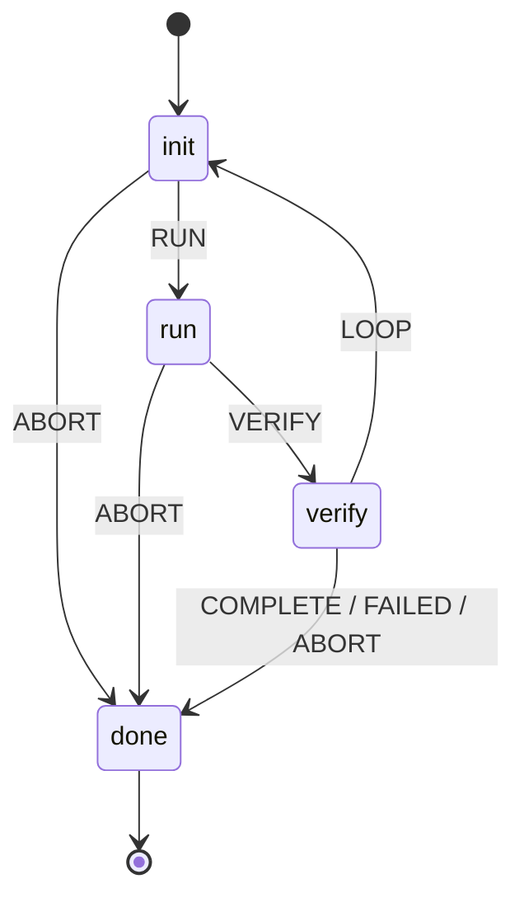

# agent-loop

[](#agent-loop)
[](LICENSE)
[](https://bun.sh)
[](__tests__)
[](https://bun.sh)

A resilient, observable **loop orchestrator for AI agents** — written in Bun + TypeScript, with **no build step**. `agent-loop` turns fragile one-shot agent scripts into dependable, long-running automation: structured plans run as repeatable loops through a strict 4-state machine, with crash recovery, budget guards, LLM/MCP tool-use, scheduled triggers, a live dashboard, and safe git-worktree isolation for self-healing fixes.

> v8 is released. v9's feedback-controller (systematic self-healing) is in active development — see [`docs/prd-v9-feedback-controller.md`](docs/prd-v9-feedback-controller.md).

---

## Why agent-loop

Agents don't run once — they **loop**. But naive loops are brittle: a crash loses progress, a stuck run never terminates, a bad fix corrupts state, and you can't tell what's happening right now.

`agent-loop` is the architecture for loops that *stack* and *survive*:

- **A real state machine**, not a `while (true)`. Every transition is explicit (`init → run → verify → done`, with a `LOOP` edge back to `init`). Unexpected repetition is a bug you can trace, not a mystery.
- **Crash recovery by design.** A `.checkpoint.json` is written after **every** completed phase. A crashed loop resumes exactly where it left off; the plan file is only mutated on full success, so it never corrupts.
- **Budget & guardrails built in.** A daily run budget flips the loop to report-only at 80% and stops it at 100%. Sensitive paths (`.env`, `auth/`, `payments/`, `secrets/`) are denylisted.
- **Self-healing, safely.** Verify failures can carry a `healCommand` re-run up to `maxRetries` inside a disposable git worktree — the LLM proposes, a verifier approves, the main branch stays clean.
- **Observable.** A daemon serves a live dashboard (WebSocket, 2s) plus REST endpoints for state, history, and metrics.

---

## Features

The architecture is **loops, by design** — they stack and survive, rather than a fragile `while (true)`.

- **Deterministic state machine** — every transition is explicit (`init → run → verify → done`, with a `LOOP` edge back to `init`) and owned by a single flat lookup table (`src/transition.ts`), so unexpected repetition is a traceable bug, not a mystery.
- **Bounded and continuous loops** — run as a one-shot bounded loop (capped at 20 iterations) or a perpetual daemon driven by `setInterval` that never self-terminates (only `SIGINT`/`SIGTERM` stops it).
- **Crash recovery by design** — a `.checkpoint.json` is written after every phase; a crashed run resumes exactly where it left off, and the plan YAML is mutated only on full success so it never corrupts.
- **Concurrent multi-loop orchestration** — one daemon supervises many child loops from `_loops.yaml` or `--plan --cron`, with priority-based collision detection to avoid conflicting runs (`src/collision.ts`).
- **Self-healing in isolation** — verify tasks with `healCommand` re-run a fix up to `maxRetries` inside a disposable git worktree, keeping the main branch clean.
- **Scheduled and event-driven triggers** — full cron expressions (`*/5 * * * *`, `N-M`, `N,M`) and a debounced file-watch that auto-moves processed plans.
- **Plan-driven execution** — point `--plan` at a `.plan.yaml`; tasks map to phases (with `dependsOn` DAG ordering) and results write back on completion.
- **MCP & LLM tool-use** — execute phases over MCP (JSON-RPC 2.0 via stdio) or an LLM controller (`--llm <server,tool>`); backends: OpenAI, Anthropic, OpenCode, and custom/Ollama endpoints.
- **Advisory LLM validator gate** — grade phase output against a rubric (`validator.criteria`); fail-open and never hard-fails, with optional command retry on failure.
- **Budget guardrails** — a daily run counter flips the loop to report-only at 80% of budget and stops it at 100%.
- **Daemon + live dashboard** — HTTP/WS server with a real-time SPA, FIFO task queue, and metrics (`GET /state`, `/api/history`, `/api/metrics`).
- **Plugin system** — five lifecycle hooks (`beforeLoop` / `afterLoop` / `onPhaseStart` / `onPhaseEnd` / `onError`) via dynamically imported modules.
- **Maker/checker plugin** — dual-phase execution with LLM verification, confidence scoring, and retry.
- **Memory hooks** — optional `agentmemory` integration (episodic save, health pulse, lesson extraction).
- **Zero build step** — Bun executes TypeScript directly; no transpile, no bundler.

---

## Installation

`agent-loop` runs on [Bun](https://bun.sh). No compilation — clone and go.

```bash
# prerequisites: Bun >= 1.x
curl -fsSL https://bun.sh/install | bash

git clone <your-repo-url> agent-loop
cd agent-loop
bun install          # installs the single runtime dep: js-yaml v5
```

---

## Quick start

```bash
# 1. scaffold the convention files (STATE.md, AGENTS.md)
bun run loop.ts init

# 2. run the built-in demo (scan → analyze → report), one iteration
bun run loop.ts start --task demo

# 3. peek at the live state
cat _agent-loop-output/STATE.md
```

That's a full bounded loop: phases execute, the state machine drives transitions, results persist.

---

## Usage

### Running a task

```bash
bun run loop.ts start --task demo
bun run loop.ts start --task demo --max-iterations 3
bun run loop.ts start --task demo --phases scan,report      # filter phases
bun run loop.ts start --timeout 60000                       # per-phase timeout (ms)
```

The built-in `demo` task runs `scan → analyze → report`. Add your own tasks to the `TASK_REGISTRY` in [`src/cli.ts`](src/cli.ts).

### Plan-driven execution

Point `--plan` at a `.plan.yaml` and the loop runs your tasks, then writes `status` / `duration` / `completedAt` back into the file on completion.

```bash
bun run loop.ts start --plan plans/daily-triage.yaml
```

A plan is a list of tasks. Each task runs a `command` and/or an LLM step:

```yaml
# plans/daily-triage.yaml
planName: daily-triage
tasks:
  - id: read-state
    command: type STATE.md
    timeoutMs: 5000
  - id: llm-triage
    command: type STATE.md
    timeoutMs: 60000
    llm:
      provider: openai          # openai | anthropic | <custom endpoint>
      prompt: >-
        You are a triage agent. Read STATE.md from stdout and return JSON with
        passed (boolean), reason (markdown report), confidence (0-1).
```

Verify tasks can heal themselves — a failed verify re-runs `healCommand` up to `maxRetries` inside a worktree:

```yaml
  - id: verify-build
    command: bun run build
    timeoutMs: 120000
    healCommand: bun run lint:fix
    maxRetries: 3
```

See [`plans/`](plans/) for `daily-triage.yaml`, `pr-babysitter.yaml`, `ci-sweeper.yaml`, and more.

### Daemon + dashboard

```bash
bun run loop.ts daemon --port 3000
bun run loop.ts daemon --port 3000 --plan plans/daily-triage.yaml --cron "0 9 * * *"
```

The daemon serves a real-time dashboard (open `http://localhost:3000`) over WebSocket (2s updates) plus REST:

| Endpoint | Purpose |
|----------|---------|
| `GET /state` | Live daemon + queue + current task state |
| `GET /api/history` | Persisted task run history |
| `GET /api/tasks/:id` | Single task record |
| `GET /api/metrics` | Pass/fail counts, p50/p95 duration, throughput, trigger fires |

If `LOOP_API_KEY` is set, requests require `Authorization: Bearer <key>` (localhost-only by default — don't expose the port).

### Triggers (cron + file-watch)

```bash
# run a plan every 5 minutes
bun run loop.ts daemon --cron "*/5 * * * *" --plan plans/ci-sweeper.yaml

# watch a directory; new .plan.yaml files are picked up and auto-moved after run
bun run loop.ts daemon --watch-dir ./incoming
```

`CronTrigger` supports `*/step`, ranges (`N-M`), and lists (`N,M`); `FileWatchTrigger` is debounced, pattern-filtered, and auto-moves processed files.

### Multi-loop orchestration

Run many child loops under one daemon via a loops config:

```bash
bun run loop.ts daemon --loops-config _loops.yaml
```

`LoopOrchestrator` (`src/orchestrator.ts`) manages each child loop's lifecycle and registers its triggers; `collision.ts` prevents conflicting patterns from running at once.

### LLM controller

```bash
bun run loop.ts start --plan plans/daily-triage.yaml --llm opencode,my-tool
```

`--llm <server,tool>` enables the LLM controller, which configures an MCP server/tool that can override loop decisions at runtime.

---

## Configuration

Most settings have both a config key and a matching CLI flag.

| Key | Default | Description | CLI flag |
|-----|---------|-------------|----------|
| `maxIterations` | `3` (hard cap `20`) | Loop iterations | `--max-iterations` |
| `task` | `demo` | Built-in task preset | `--task` |
| `phases` | all | Comma-separated phase filter | `--phases` |
| `timeout` | `30000` | Per-phase timeout (ms) | `--timeout` |
| `port` | `3000` (daemon) / `3099` (start) | HTTP API port | `--port` |
| `planPath` | — | Plan-driven YAML | `--plan` |
| `daemon` | `false` | Daemon mode (REST + WS) | `--daemon` |
| `memory.enabled` | `false` | agentmemory hooks | `--memory` |
| `llm.provider` | — | LLM controller backend | `--llm <server,tool>` |
| `triggers` | — | cron / file-watch | `--cron`, `--watch-dir` |
| `plugins` | `[]` | Plugin module paths | `--plugins` |
| `loopsConfig` | — | Multi-loop config | `--loops-config` |

---

## Architecture

### State machine



The `LOOP` edge (`verify → init`) is the explicit loop *within* one run. Inspect `src/state-machine.ts` + `src/transition.ts` first when a run repeats unexpectedly.

### Data flow

1. CLI → `config.ts` parses args (incl. `--plan`), merges with `DEFAULT_CONFIG`.
2. `plan-executor.ts` `beforeLoop` reads the `.plan.yaml` → maps tasks to `PhaseDef[]`.
3. `state-machine.ts` drives the loop: execute phase → collect result → evaluate → persist → repeat or exit.
4. Each phase runs via `mcp.ts` (MCP subprocess) or the shared `execute-phases.ts` path.
5. `checkpoint.ts` writes `.checkpoint.json` after **every** completed phase (crash recovery).
6. `plan-executor.ts` `afterLoop` writes results back to the plan YAML — only on full completion.
7. `daemon.ts` serves REST + WebSocket; `triggers.ts` fires scheduled/file events → `orchestrator.ts` spawns child loops.
8. `worktree.ts` isolates fixes; `recovery.ts` (v9) classifies failures and applies a deterministic heal policy.

### Module map (41 modules in `src/`)

| Subsystem | Key files |
|-----------|-----------|
| Core engine | `loop.ts` (entry), `cli.ts`, `state-machine.ts`, `state.ts`, `loop-runner.ts`, `safety.ts`, `config.ts`, `plugins.ts`, `plan-executor.ts`, `execute-phases.ts`, `checkpoint.ts`, `transition.ts`, `loop-core.ts`, `types.ts`, `index.ts` |
| Shell & YAML | `shell.ts`, `yaml.ts` |
| MCP & LLM | `mcp.ts`, `llm.ts`, `json-rpc.ts`, `evaluate.ts`, `eval-core.ts` |
| Memory | `agentmemory.ts`, `memory-hooks.ts` |
| Daemon | `daemon.ts`, `daemon-api.ts`, `routes.ts`, `dashboard-api.ts`, `task-processor.ts`, `task-queue.ts`, `triggers.ts`, `history.ts`, `run-log.ts`, `metrics.ts` |
| Orchestration | `orchestrator.ts`, `worktree.ts`, `collision.ts`, `budget.ts` |
| Recovery | `recovery.ts`, `_prototype-feedback-controller.ts` (v9) |
| Plugins | `maker-checker-plugin.ts` |
| Init | `init.ts` |

---

## Project structure

```
agent-loop/
├── loop.ts                 # CLI entry point
├── src/                    # 41 TypeScript modules (see module map)
├── plans/                  # example .plan.yaml files
├── docs/
│   ├── adr/                # Architecture Decision Records (0001, 0002, 0003, 0004, 0008–0013)
│   └── prd-v9-feedback-controller.md
├── __tests__/              # 438 tests across 33 files
├── PLAN-WRITING-GUIDE.md   # how to author a correct .plan.yaml
├── AGENTS.md               # loop-safety rules (read before any loop work)
└── package.json
```

---

## Safety & guardrails

`agent-loop` is a **loop system by design** — loops stack, so it ships with binding guardrails (full rules in [`AGENTS.md`](AGENTS.md)):

- **L1 report-only vs L2 implementer.** Start in L1: read state, produce a report, change nothing. L2 (source edits) requires explicit human enablement and runs inside a git worktree; a verifier sub-agent APPROVE/REJECTs.
- **Never** push / merge / close issues or PRs without human approval.
- **Never** touch `.env`, `.env.*`, `auth/`, `payments/`, `secrets/`, `credentials/`, or infra configs without approval.
- **Max 3 fix attempts** per item; escalate after.
- **Budget guard:** at 80% of the daily run cap → switch to report-only (`loop-pause-all` = exit immediately).
- **Crash handlers** set state to `ABORT` so a loop never sticks in `run`.

---

## Development & testing

```bash
bun test                       # full suite — 438 tests across 33 files
bun test __tests__/task-processor.test.ts   # a single file
bun run src/_prototype-feedback-controller.ts  # v9 feedback-controller prototype
```

No `build` / `compile`: Bun runs `.ts` on the fly. Don't add a transpile step.

---

## Programmatic API

`agent-loop` is also importable as a typed module (`package.json` → `"module": "src/index.ts"`). The barrel [`src/index.ts`](src/index.ts) exports the engine surface:

```ts
import {
  StateMachine,          // 4-state FSM
  Daemon,                // HTTP/WS daemon
  LoopOrchestrator,      // concurrent child loops
  TaskQueue,             // FIFO task queue
  createMakerCheckerPlugin,
  DEFAULT_CONFIG,
  mergeConfig,
  executeMcpPhase,
  evaluatePhase,
  loadPlugins,
  initProject,
} from "agent-loop";

import type { LoopConfig, PhaseDef, LoopState, LoopResult } from "agent-loop";
```

---

## Documentation

- **Architecture Decisions** — [`docs/adr/`](docs/adr/) (ADR-0001, 0002, 0003, 0004, 0008–0013): raw-HTTP agentmemory transport, daemon slice, YAML consolidation, feedback controller, and more.
- **Plan authoring** — [`PLAN-WRITING-GUIDE.md`](PLAN-WRITING-GUIDE.md): every `.plan.yaml` needs `read-state`, a real `command` on LLM tasks, absolute paths, and a verify/build final task.
- **Loop safety** — [`AGENTS.md`](AGENTS.md): the rules that govern all loop work in this repo.

---

## Contributing

1. Read [`AGENTS.md`](AGENTS.md) — loops are the architecture here, and the guardrails are binding.
2. Read [`PLAN-WRITING-GUIDE.md`](PLAN-WRITING-GUIDE.md) before authoring any plan under `plans/`.
3. Stay in **L1 (report-only)** until a change is reviewed and L2 is enabled.
4. Every code change happens in a git worktree; a verifier approves before merge.
5. Keep tests green: `bun test`.

---

## License

[MIT](LICENSE) © agent-loop contributors.
